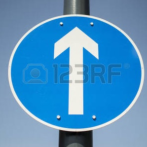

## Traffic Sign Recognition

The goals / steps of this project(from the Udacity Self Driving Car program) are the following:
+ Load the data set (see below for links to the project data set)

+ Explore, summarize and visualize the data set

+ Design, train and test a model architecture

+ Use the model to make predictions on new images

+ Analyze the softmax probabilities of the new images

+ Summarize the results with a written report

--- 

### Data Set Summary & Exploration

The code for this step is contained in the second code cell of the IPython notebook.  

I used the numpy functions to calculate summary statistics of the traffic
signs data set:

* The size of the Original training set is 34799. I have made some extensions to this.
* The size of test set is 12630
* The shape of a traffic sign image is  (32, 32, 3)
* The number of unique classes/labels in the data set is 43

2. Include an exploratory visualization of the dataset and identify where the code is in your code file.

The code for this step is contained in the third code cell of the IPython notebook.  

There are 43 different traffic signs. And I've taken a look at one example from each.
They seem to be taken in different lighting conditions. The speed limit signs (e.g. speed limit 20) seem to be fairly well lit. However, there were at least a few examples(keep right, children crossing,dangerous curve to the left) etc which were not that visible.

--- 

### Design and Test a Model Architecture

#### 1. Pre-processing

Normalization : Subract 128 and Divide by 128 to get RGB intensities into -1 to 1 range. 
Why: It's easier for Neural nets to optimize in this range.

#### 2. 
Training, Test and Validation set were provided as a part of the project. I did not have to create a separate validation set.

The difference between the original data set and the augmented data set is the following ... 
I did the following operations to augment the dataset.
i. Zoom(LeCun paper) by a factor of 1.1 and prune it to ensure same size as input
ii. Rotate by +15(LeCun paper)
iii. Rotate by -15(LeCun paper)

Together, this had the effect of multiplying the training set by 4x.

#### 3. Describe, and identify where in your code, what your final model architecture looks like including model type, layers, layer sizes, connectivity, etc.) Consider including a diagram and/or table describing the final model.

I used the existing architecture from the LeNet Solution. 
The main change I made was to handle the change in the number of classes(43).

Layer 1: Convolutional. Input = 32x32x3. Output = 28x28x6.
Next Layer: RELU Activation
Next Layer: Pooling. Input = 28x28x6. Output = 14x14x6.

Layer 2: Convolutional. Output = 10x10x16.
Next Layer: RELU Activation
Next Layer: Pooling. Input = 10x10x16. Output = 5x5x16.

Next Layer: Flatten. Input = 5x5x16. Output = 400.

Layer 3: Fully Connected. Input = 400. Output = 120.
Next Layer: RELU Activation

Layer 4: Fully Connected. Input = 120. Output = 84.
Next Layer: RELU Activation
Layer 5: Fully Connected. Input = 84. Output = 43

#### 4. HyperParameters

The Optimizer used is the Gradient Descent optimizer.
The Learning Rate = 0.001
EPOCHS = 10.
BATCH_SIZE = 128
The Optimization being performed is minimizing the loss using gradient descent where the loss is measured by the error rate of the classifier. 

#### 5. Approach

Initially I implemented the LeNet solution as such.
Then I implemented the normalizing routine to  pre-process the data. That helped improve performance on the test-set.
Then I augmented by training set with more examples by applying some image-processing techniques like zoom and rotation. This helped improve the performance on the web-images.

My final model results were:
* training set accuracy of ? 0.98

* validation set accuracy of ? 0.91

* test set accuracy of ?0.91

If a well known architecture was chosen: 
* What architecture was chosen? 
LeNet Solution from example with tweaks to pre-processing based on ideas from the paper

* Why did you believe it would be relevant to the traffic sign application?
It was used in the LeCun paper to solve the same problem.

* How does the final model's accuracy on the training, validation and test set provide evidence that the model is working well?
The Test set accuracy is comparable to that of the validation set accuracy which gives me confidence that the model is working well 

--- 

### Test a Model on New Images

#### 1. Choice of New Images

Please see attached folder web_images for the actual images.

Ahead Only:

Pedestrians:

Children Crossing

No Entry:

General Caution:
 

Not a Sign!

Example qualities  which make it difficult to identify images:
i. Angle of sign - If it's not directly facing the camera, it can be tricky
For this we could apply some image pre-processing to our training set.
ii. Lighting/weather conditions.
iii. Obstructions - there could be another object hiding parts of the sign  (e.g. my General caution_1.jpg)
iv. Multiple signs

#### 2. Predictions on the new images

I got the images using google and I had to crop the images into a square shape using Preview. 
I then had to apply scaling using PIL(code in iPython notebook) to convert it to 32 by 32 by 3.

Here are the results of the prediction:

| Image | Prediction |
| ------ | ----------|
| Ahead only | Ahead only |
| Pedestrians| Pedestrians |
| Children crossing | Children crossing |
| No entry | Priority road ->Wrong! |
| No entry | No entry |
| General caution | General caution |
| General caution | General caution |

The model was able to correctly guess 6 of the 7 traffic signs, which gives an accuracy of 85%. This compares favorably to the accuracy on the test set of 91%

#### 3.Softmax probabilities for predictions on new images

| Image | Prediction |Probability |
| --- | --- | --- |
| Ahead only | Ahead only | 1.00000000e+00 ->High Confidence |
| Pedestrians |Pedestrians | 8.05804670e-01->Reasonably High confidence |
| Children crossing | Children crossing | 9.99999762e-01->High Confidence |
| No entry | Priority road | 1.00000000e+00->High confidence but wrong! |
| No entry | No entry | 9.99992132e-01->High confidence |
| General caution | General caution | 1.00000000e+00 ->High confidence |
| General caution| General caution| 1.00000000e+00 ->High confidence  |

I've added bar charts to visualize these.

Step 4: Visualize the Neural Network's State with Test Images

I looked at the activations at conv1 and conv2. It's hard to generalize observations based on just two images(a General caution picture and a cat picture). But I'll take a stab at creating a few possibile hypothesis.

Conv1 Layer:

In conv1 layer, FeatureMap2 seems to be adding noise. I see it produce blurry versions of the image in both the examples I looked at. This may help the network in generalizing better.

FeatureMap 5 is particularly good at identifying areas which are high contrast. In the General caution picture(sign present scenario), this map identified the triangular red zone which is in high contrast to its white neighborhood.
In case of the cat picture(no sign scenario), this map identified the cat's eyes and nose which are dark and in contrast with the white/grey neighborhood.

Conv2 Layer:

FeatureMap10 from conv2 layer did a great job in finding the black vertical exclamation mark in the General caution picture and found the (approximately)vertical black nostril area in the cat picture. This could mean that FeatureMap5 is a vertical edge detector.

